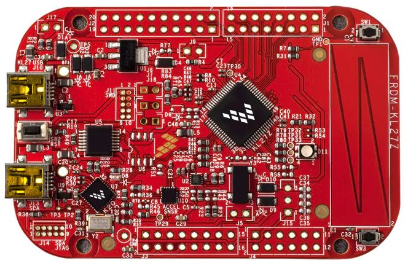

.. _frdm_kl27z:

NXP FRDM-KL27Z
##############

Overview
********

The FRDM-KL27Z is an ultra-low-cost development platform for
the Kinetis |reg| L Series KL17 and KL27 MCUs built
on the Arm® Cortex®-M0+ processor.

The FRDM-KL27Z features include easy access to MCU I/O, battery-ready,
low-power operation, a standards-based form factor with
expansion board options and a built-in debug interface
for flash programming and run-control

Hardware
********

- MKL27Z64VLH4 MCU @ 48 MHz, 64 KB flash, 16 KB SRAM, USB OTG (FS), 64LQFP
- On board capacitive touch "slider", MMA8451Q accelerometer, Magnetometer MAG3110,
thermistor sensor to measuring temperature and tri-color LED
- OpenSDA debug interface

For more information about the KL27Z SoC and FRDM-KL27Z board:

- `KL27Z Website`_
- `KL27Z Datasheet`_
- `KL27Z Reference Manual`_
- `FRDM-KL27Z Website`_
- `FRDM-KL27Z User Guide`_
- `FRDM-KL27Z Schematics`_

Supported Features
==================

The frdm_kl27z board configuration supports the following hardware features:

+-----------+------------+-------------------------------------+
| Interface | Controller | Driver/Component                    |
+===========+============+=====================================+
| NVIC      | on-chip    | nested vector interrupt controller  |
+-----------+------------+-------------------------------------+
| SYSTICK   | on-chip    | systick                             |
+-----------+------------+-------------------------------------+
| PINMUX    | on-chip    | pinmux                              |
+-----------+------------+-------------------------------------+
| GPIO      | on-chip    | gpio                                |
+-----------+------------+-------------------------------------+
| UART      | on-chip    | serial port-polling;                |
|           |            | serial port-interrupt               |
+-----------+------------+-------------------------------------+
| I2C       | on-chip    | i2c                                 |
+-----------+------------+-------------------------------------+
| ADC       | on-chip    | adc                                 |
+-----------+------------+-------------------------------------+
| FLASH     | on-chip    | soc flash                           |
+-----------+------------+-------------------------------------+
| USB       | on-chip    | USB device                          |
+-----------+------------+-------------------------------------+

The default configuration can be found in the defconfig file:

	``boards/arm/frdm_kl27z/frdm_kl27z_defconfig``

Other hardware features are not currently supported by the port.

Connections and IOs
===================

The KL27Z SoC has five pairs of pinmux/gpio controllers, and all are currently enabled
(PORTA/GPIOA, PORTB/GPIOB, PORTC/GPIOC, PORTD/GPIOD, and PORTE/GPIOE) for the FRDM-KL27Z board.

+-------+-------------+---------------------------+
| Name  | Function    | Usage                     |
+=======+=============+===========================+
| PTB2  | ADC         | ADC0 channel 12           |
+-------+-------------+---------------------------+
| PTB18 | GPIO        | Red LED                   |
+-------+-------------+---------------------------+
| PTB19 | GPIO        | Green LED                 |
+-------+-------------+---------------------------+
| PTD1  | GPIO        | Blue LED                  |
+-------+-------------+---------------------------+
| PTA1  | LPUART0_RX  | UART Console              |
+-------+-------------+---------------------------+
| PTA2  | LPUART0_TX  | UART Console              |
+-------+-------------+---------------------------+
| PTE24 | I2C0_SCL    | I2C                       |
+-------+-------------+---------------------------+
| PTE25 | I2C0_SDA    | I2C                       |
+-------+-------------+---------------------------+

System Clock
============

The KL27Z SoC is configured to use the 8 MHz external oscillator on the board
with the on-chip FLL to generate a 48 MHz system clock.

Serial Port
===========

The KL27Z LPUART0 is used for the console.

USB
===

The KL27Z SoC has a USB OTG (USBOTG) controller that supports both
device and host functions through its mini USB connector (USB KL27Z).
Only USB device function is supported in Zephyr at the moment.

Programming and Debugging
*************************

Build and flash applications as usual (see :ref:`build_an_application` and
:ref:`application_run` for more details).

Configuring a Debug Probe
=========================

A debug probe is used for both flashing and debugging the board. This board is
configured by default to use the :ref:`opensda-daplink-onboard-debug-probe`.

Early versions of this board have an outdated version of the OpenSDA bootloader
and require an update. Please see the `DAPLink Bootloader Update`_ page for
instructions to update from the CMSIS-DAP bootloader to the DAPLink bootloader.

Option 1: :ref:`opensda-daplink-onboard-debug-probe` (Recommended)
------------------------------------------------------------------

Install the :ref:`pyocd-debug-host-tools` and make sure they are in your search
path.

Follow the instructions in :ref:`opensda-daplink-onboard-debug-probe` to program
the `OpenSDA DAPLink FRDM-KL27Z Firmware`_.

Option 2: :ref:`opensda-jlink-onboard-debug-probe`
--------------------------------------------------

################TO BE CHECKED

Install the :ref:`jlink-debug-host-tools` and make sure they are in your search
path.

Follow the instructions in :ref:`opensda-jlink-onboard-debug-probe` to program
the `OpenSDA J-Link FRDM-KL27Z Firmware`_.

Add the argument ``-DOPENSDA_FW=jlink`` when you invoke ``cmake`` or ``west
build`` to override the default runner from pyOCD to J-Link:

.. zephyr-app-commands::
   :zephyr-app: samples/hello_world
   :board: frdm_kl27z
   :gen-args: -DOPENSDA_FW=jlink
   :goals: build

Configuring a Console
=====================

Regardless of your choice in debug probe, we will use the OpenSDA
microcontroller as a usb-to-serial adapter for the serial console.

Connect a USB cable from your PC to J7.

Use the following settings with your serial terminal of choice (minicom, putty,
etc.):

- Speed: 115200
- Data: 8 bits
- Parity: None
- Stop bits: 1

Flashing
========

Here is an example for the :ref:`hello_world` application.

.. zephyr-app-commands::
   :zephyr-app: samples/hello_world
   :board: frdm_kl27z
   :goals: flash

Open a serial terminal, reset the board (press the SW1 button), and you should
see the following message in the terminal:

.. code-block:: console

   ***** Booting Zephyr OS v1.14.0-rc1 *****
   Hello World! frdm_kl27z

Debugging
=========

Here is an example for the :ref:`hello_world` application.

.. zephyr-app-commands::
   :zephyr-app: samples/hello_world
   :board: frdm_kl27z
   :goals: debug

Open a serial terminal, step through the application in your debugger, and you
should see the following message in the terminal:

.. code-block:: console

   ***** Booting Zephyr OS v1.14.0-rc1 *****
   Hello World! frdm_kl27z

.. _FRDM-KL27Z Website:
   https://www.nxp.com/support/developer-resources/evaluation-and-development-boards/freedom-development-boards/mcu-boards/freedom-development-platform-for-kinetis-kl17-and-kl27-mcus:FRDM-KL27Z

.. _FRDM-KL27Z User Guide:
   https://www.nxp.com/webapp/Download?colCode=FRDMKL27ZUG

.. _FRDM-KL25Z Schematics:
   https://www.nxp.com/downloads/en/schematics/FRDM-KL25Z_SCH_REV_E.pdf

.. _KL25Z Website:
   https://www.nxp.com/products/processors-and-microcontrollers/arm-based-processors-and-mcus/kinetis-cortex-m-mcus/l-seriesultra-low-powerm0-plus/kinetis-kl2x-72-96mhz-usb-ultra-low-power-microcontrollers-mcus-based-on-arm-cortex-m0-plus-core:KL2x?&l

.. _KL25Z Datasheet:
   https://www.nxp.com/docs/en/data-sheet/KL25P80M48SF0.pdf

.. _KL25Z Reference Manual:
   https://www.nxp.com/docs/en/reference-manual/KL25P80M48SF0RM.pdf

.. _DAPLink Bootloader Update:
   https://os.mbed.com/blog/entry/DAPLink-bootloader-update/

.. _OpenSDA DAPLink FRDM-KL25Z Firmware:
   https://www.nxp.com/assets/downloads/data/en/ide-debug-compile-build-tools/OpenSDAv2.2_DAPLink_frdmkl25z_rev0242.zip

.. _OpenSDA J-Link FRDM-KL25Z Firmware:
   https://www.segger.com/downloads/jlink/OpenSDA_FRDM-KL25Z
